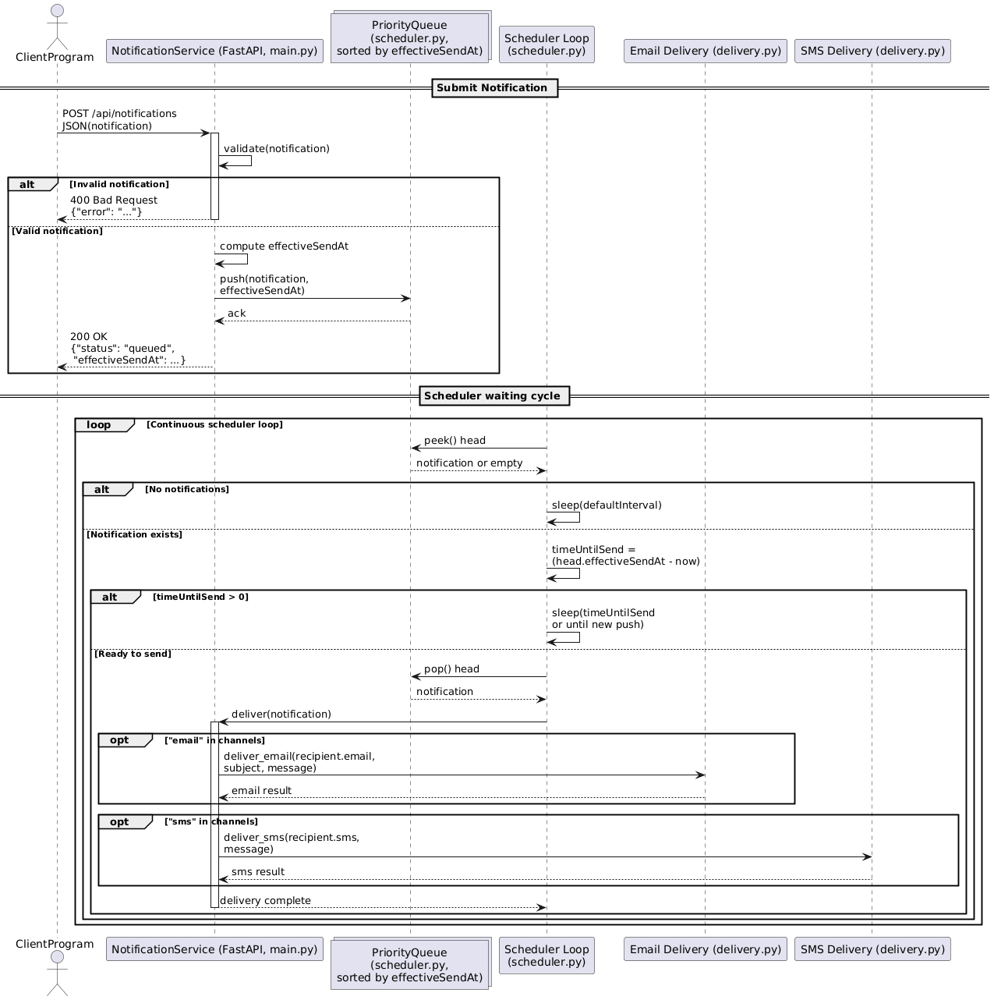

# Notification Service
## Getting started

To make it easy to get started with this project, here’s a quick setup guide.

### Clone the Repository
```bash
git clone https://gitlab.engr.oregonstate.edu/group-49/notification-service.git
cd notification-service
```

### Create and Activate a Virtual Environment
```bash
python -m venv .venv
```

#### Windows
```bash
.venv\Scripts\activate
```

#### Mac/Linux
```bash
source .venv/bin/activate
```

### Install Dependencies
```bash
pip install -r requirements.txt
```

### Create and Populate Environment Variables
This service requires a Gmail address and App Password for sending email via SMTP.
Create a ``.env`` file in the root directory ``./notification-service`` and paste the following, replacing the values with those for your Google account.
```
GMAIL_ADDRESS=your_email@gmail.com
GMAIL_APP_PASSWORD=your_generated_app_password
```
*See https://support.google.com/accounts/answer/185833?hl=en for creating a Google app password

### Run the Service
```bash
python -m uvicorn app.main:app --reload
```

Visit http://localhost:8000/docs for the Swagger UI.

## Description
A Python-based microservice built with FastAPI that handles sending notifications by Email and SMS.
Supports both immediate and scheduled notifications with optional offsets.
This service is part of Group 49’s microservices.

## Usage
### Immediate Notification Example
```bash
curl -X POST http://localhost:8000/api/notifications \
  -H "Content-Type: application/json" \
  -d '{
    "recipient": { "email": "user@example.com", "sms": "+14055551234" },
    "channels": ["email", "sms"],
    "subject": "System Update",
    "message": "Systems are a go!"
  }'
```
### Scheduled Notification Example
```bash
curl -X POST http://localhost:8000/api/notifications \
  -H "Content-Type: application/json" \
  -d '{
    "recipient": { "email": "user@example.com" },
    "channels": ["email"],
    "subject": "Task Reminder",
    "message": "Task coming up!",
    "scheduledAt": "2025-11-12T00:00:00Z",
    "offsetMinutes": -15
  }'
```

### UML Diagram


### API Endpoints
| Method | Endpoint             | Description                     |
| ------ | -------------------- | ------------------------------- |
| `POST` | `/api/notifications` | Send or schedule a notification |
| `GET`  | `/api/health`        | Health check endpoint           |

## Contributing
Team 49 Members:

**Bryson Davis**

**Luke Sheperd**

## Project status
#### WIP
